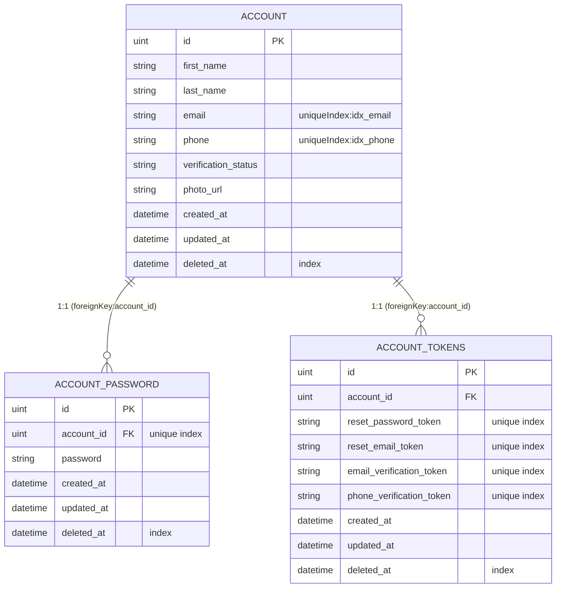

```mermaid

erDiagram
    ACCOUNT {
        uint id PK
        string first_name
        string last_name
        string email "uniqueIndex:idx_email"
        string phone "uniqueIndex:idx_phone"
        string verification_status
        string photo_url
        datetime created_at
        datetime updated_at
        datetime deleted_at "index"
    }

    ACCOUNT_PASSWORD {
        uint id PK
        uint account_id FK "unique index"
        string password
        datetime created_at
        datetime updated_at
        datetime deleted_at "index"
    }

    ACCOUNT_TOKENS {
        uint id PK
        uint account_id FK
        string reset_password_token "unique index"
        string reset_email_token "unique index"
        string email_verification_token "unique index"
        string phone_verification_token "unique index"
        datetime created_at
        datetime updated_at
        datetime deleted_at "index"
    }

    ACCOUNT ||--o{ ACCOUNT_PASSWORD : "1:1 (foreignKey:account_id)"
    ACCOUNT ||--o{ ACCOUNT_TOKENS : "1:1 (foreignKey:account_id)"

```