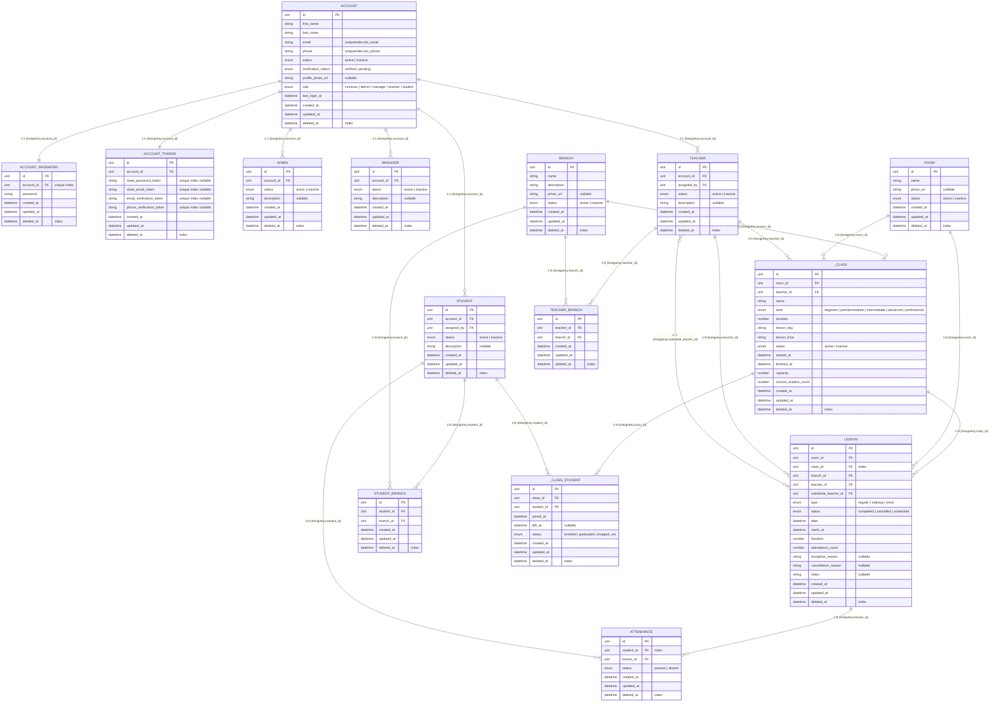

```mermaid

erDiagram
    ACCOUNT {
        uint id PK
        string first_name
        string last_name
        string email "uniqueIndex:idx_email"
        string phone "uniqueIndex:idx_phone"
        enum status "active | inactive"
        enum verification_status "verified | pending"
        string profile_photo_url "nullable"
        enum role "common | admin | manager | teacher | student"
        datetime last_login_at
        datetime created_at
        datetime updated_at
        datetime deleted_at "index"
    }

    ACCOUNT_PASSWORD {
        uint id PK
        uint account_id FK "unique index"
        string password
        datetime created_at
        datetime updated_at
        datetime deleted_at "index"
    }

    ACCOUNT_TOKENS {
        uint id PK
        uint account_id FK
        string reset_password_token "unique index nullable"
        string reset_email_token "unique index nullable"
        string email_verification_token "unique index nullable"
        string phone_verification_token "unique index nullable"
        datetime created_at
        datetime updated_at
        datetime deleted_at "index"
    }

    ADMIN {
        uint id PK
        uint account_id FK
        enum status "active | inactive"
        string description "nullable"
        datetime created_at
        datetime updated_at
        datetime deleted_at "index"
    }

    MANAGER {
        uint id PK
        uint account_id FK
        enum status "active | inactive"
        string description "nullable"
        datetime created_at
        datetime updated_at
        datetime deleted_at "index"
    }

    TEACHER {
        uint id PK
        uint account_id FK
        uint assigned_by FK
        enum status "active | inactive"
        string description "nullable"
        datetime created_at
        datetime updated_at
        datetime deleted_at "index"
    }

    STUDENT {
        uint id PK
        uint account_id FK
        uint assigned_by FK
        enum status "active | inactive"
        string description "nullable"
        datetime created_at
        datetime updated_at
        datetime deleted_at "index"
    }

    BRANCH {
        uint id PK
        string name
        string description
        string photo_url "nullable"
        enum status "active | inactive"
        datetime created_at
        datetime updated_at
        datetime deleted_at "index"
    }

    ROOM {
        uint id PK
        string name
        string photo_url "nullable"
        enum status "active | inactive"
        datetime created_at
        datetime updated_at
        datetime deleted_at "index"
    }

    _CLASS {
        uint id PK
        uint room_id FK
        uint teacher_id FK
        string name
        enum level "beginner | preintermediate | intermediate | advanced | professional"
        number duration
        string lesson_day
        string lesson_time
        enum status "active | inactive"
        datetime started_at
        datetime finished_at
        number capacity
        number current_student_count
        datetime created_at
        datetime updated_at
        datetime deleted_at "index"
    }

    LESSON {
        uint id PK
        uint room_id FK
        uint class_id FK "index"
        uint branch_id FK
        uint teacher_id FK
        uint substitute_teacher_id FK
        enum type "regular | makeup | extra"
        enum status "completed | cancelled | scheduled"
        datetime date
        datetime starts_at
        number duration
        number attendance_count
        string exception_reason "nullable"
        string cancellation_reason "nullable"
        string notes "nullable"
        datetime created_at
        datetime updated_at
        datetime deleted_at "index"
    }

    ATTENDANCE {
        uint id PK
        uint student_id FK "index"
        uint lesson_id FK
        enum status "present | absent"
        datetime created_at
        datetime updated_at
        datetime deleted_at "index"
    }

    TEACHER_BRANCH {
        uint id PK
        uint teacher_id FK
        uint branch_id FK
        datetime created_at
        datetime updated_at
        datetime deleted_at "index"
    }

    STUDENT_BRANCH {
        uint id PK
        uint student_id FK
        uint branch_id FK
        datetime created_at
        datetime updated_at
        datetime deleted_at "index"
    }

    _CLASS_STUDENT {
        uint id PK
        uint class_id FK
        uint student_id FK
        datetime joined_at
        datetime left_at "nullable"
        enum status "enrolled | graduated | dropped_out"
        datetime created_at
        datetime updated_at
        datetime deleted_at "index"
    }

    ACCOUNT ||--|| ACCOUNT_PASSWORD : "1:1 (foreignKey:account_id)"
    ACCOUNT ||--|| ACCOUNT_TOKENS : "1:1 (foreignKey:account_id)"

    ACCOUNT ||--o{ ADMIN : "1:1 (foreignKey:account_id)"
    ACCOUNT ||--o{ MANAGER : "1:1 (foreignKey:account_id)"
    ACCOUNT ||--o{ TEACHER : "1:1 (foreignKey:account_id)"
    ACCOUNT ||--o{ STUDENT : "1:1 (foreignKey:account_id)"

    TEACHER ||--o{ TEACHER_BRANCH : "1:N (foreignKey:teacher_id)"
    BRANCH ||--o{ TEACHER_BRANCH : "1:N (foreignKey:branch_id)"

    STUDENT ||--o{ STUDENT_BRANCH : "1:N (foreignKey:student_id)"
    BRANCH ||--o{ STUDENT_BRANCH : "1:N (foreignKey:branch_id)"

    BRANCH ||--o{ _CLASS : "1:N (foreignKey:branch_id)"

    ROOM ||--o{ _CLASS : "1:N (foreignKey:room_id)"

    TEACHER ||--o{ _CLASS : "1:N (foreignKey:teacher_id)"

    _CLASS ||--o{ _CLASS_STUDENT : "1:N (foreignKey:class_id)"
    STUDENT ||--o{ _CLASS_STUDENT : "1:N (foreignKey:student_id)"

    _CLASS ||--o{ LESSON : "1:N (foreignKey:class_id)"

    ROOM ||--o{ LESSON : "1:N (foreignKey:room_id)"

    TEACHER ||--o{ LESSON : "1:N (foreignKey:teacher_id)"
    TEACHER }o--o{ LESSON : "0..1 (foreignKey:substitute_teacher_id)"

    LESSON ||--o{ ATTENDANCE : "1:N (foreignKey:lesson_id)"
    STUDENT ||--o{ ATTENDANCE : "1:N (foreignKey:student_id)"

```
