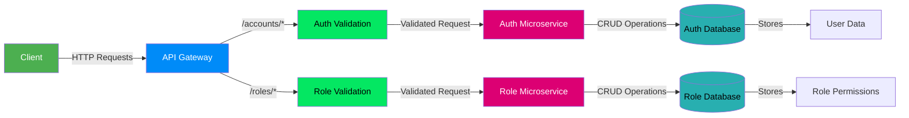

```mermaid

flowchart LR
    %% Nodes
    Client[Client] -->|HTTP Requests| Gateway_API[API Gateway]
    
    %% Authentication Flow
    Gateway_API -->|/accounts/*| Auth_Validation[Auth Validation]
    Auth_Validation -->|Validated Request| Auth_Microservice[Auth Microservice]
    Auth_Microservice -->|CRUD Operations| Auth_DB[(Auth Database)]
    Auth_DB -->|Stores| User_Data[User Data]
    
    %% Role Management Flow
    Gateway_API -->|/roles/*| Role_Validation[Role Validation]
    Role_Validation -->|Validated Request| Role_Microservice[Role Microservice]
    Role_Microservice -->|CRUD Operations| Role_DB[(Role Database)]
    Role_DB -->|Stores| Role_Data[Role Permissions]
    
    %% Visual Styles
    classDef client fill:#4CAF50,color:white
    classDef gateway fill:#008BF8,color:white
    classDef validation fill:#04E762,color:black
    classDef microservice fill:#DC0073,color:white
    classDef database fill:#28AFB0,color:black
    
    class Client client
    class Gateway_API gateway
    class Auth_Validation,Role_Validation validation
    class Auth_Microservice,Role_Microservice microservice
    class Auth_DB,Role_DB database

```