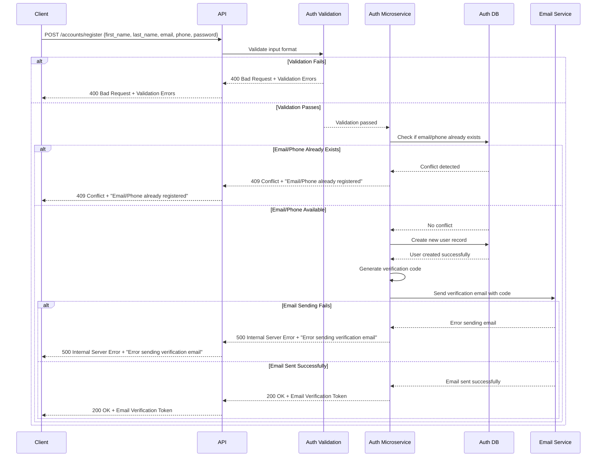

```mermaid

sequenceDiagram
    participant Client
    participant API_Gateway as API
    participant Auth_Validation as Auth Validation
    participant Auth_Service as Auth Microservice
    participant Auth_DB as Auth DB
    participant Email_Service as Email Service

    %% Registration Flow
    Client->>API_Gateway: POST /accounts/register {first_name, last_name, email, phone, password}
    API_Gateway->>Auth_Validation: Validate input format

    alt Validation Fails
        Auth_Validation-->>API_Gateway: 400 Bad Request + Validation Errors
        API_Gateway-->>Client: 400 Bad Request + Validation Errors
    else Validation Passes
        Auth_Validation-->>Auth_Service: Validation passed
        Auth_Service->>Auth_DB: Check if email/phone already exists
        alt Email/Phone Already Exists
            Auth_DB-->>Auth_Service: Conflict detected
            Auth_Service-->>API_Gateway: 409 Conflict + "Email/Phone already registered"
            API_Gateway-->>Client: 409 Conflict + "Email/Phone already registered"
        else Email/Phone Available
            Auth_DB-->>Auth_Service: No conflict
            Auth_Service->>Auth_DB: Create new user record
            Auth_DB-->>Auth_Service: User created successfully
            Auth_Service->>Auth_Service: Generate verification code
            Auth_Service->>Email_Service: Send verification email with code

            alt Email Sending Fails
                Email_Service-->>Auth_Service: Error sending email
                Auth_Service-->>API_Gateway: 500 Internal Server Error + "Error sending verification email"
                API_Gateway-->>Client: 500 Internal Server Error + "Error sending verification email"
            else Email Sent Successfully
                Email_Service-->>Auth_Service: Email sent successfully
                Auth_Service-->>API_Gateway: 200 OK + Email Verification Token
                API_Gateway-->>Client: 200 OK + Email Verification Token
            end
        end
    end

```
