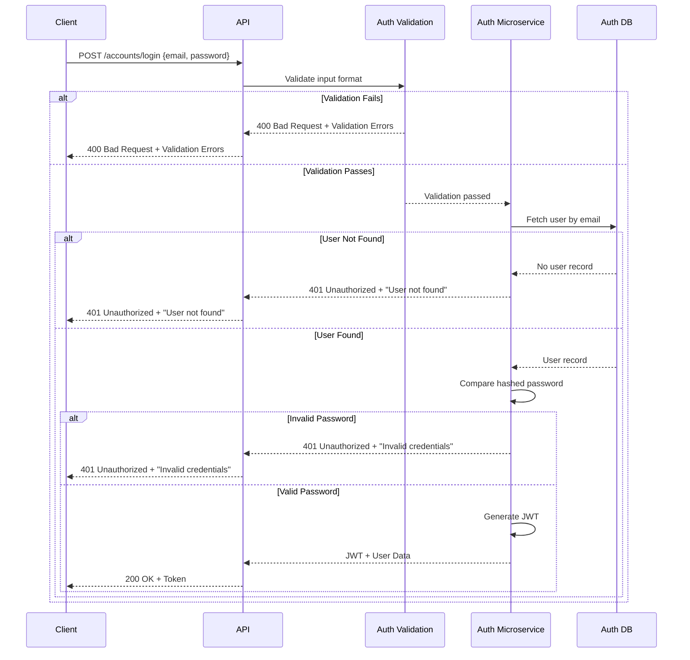

```mermaid

sequenceDiagram
    participant Client
    participant API_Gateway as API
    participant Auth_Validation as Auth Validation
    participant Auth_Service as Auth Microservice
    participant Auth_DB as Auth DB

    %% Successful Authentication Flow
    Client->>API_Gateway: POST /accounts/login {email, password}
    API_Gateway->>Auth_Validation: Validate input format
    
    alt Validation Fails
        Auth_Validation-->>API_Gateway: 400 Bad Request + Validation Errors
        API_Gateway-->>Client: 400 Bad Request + Validation Errors
    else Validation Passes
        Auth_Validation-->>Auth_Service: Validation passed
        Auth_Service->>Auth_DB: Fetch user by email
        alt User Not Found
            Auth_DB-->>Auth_Service: No user record
            Auth_Service-->>API_Gateway: 401 Unauthorized + "User not found"
            API_Gateway-->>Client: 401 Unauthorized + "User not found"
        else User Found
            Auth_DB-->>Auth_Service: User record
            Auth_Service->>Auth_Service: Compare hashed password
            alt Invalid Password
                Auth_Service-->>API_Gateway: 401 Unauthorized + "Invalid credentials"
                API_Gateway-->>Client: 401 Unauthorized + "Invalid credentials"
            else Valid Password
                Auth_Service->>Auth_Service: Generate JWT
                Auth_Service-->>API_Gateway: JWT + User Data
                API_Gateway-->>Client: 200 OK + Token
            end
        end
    end

```