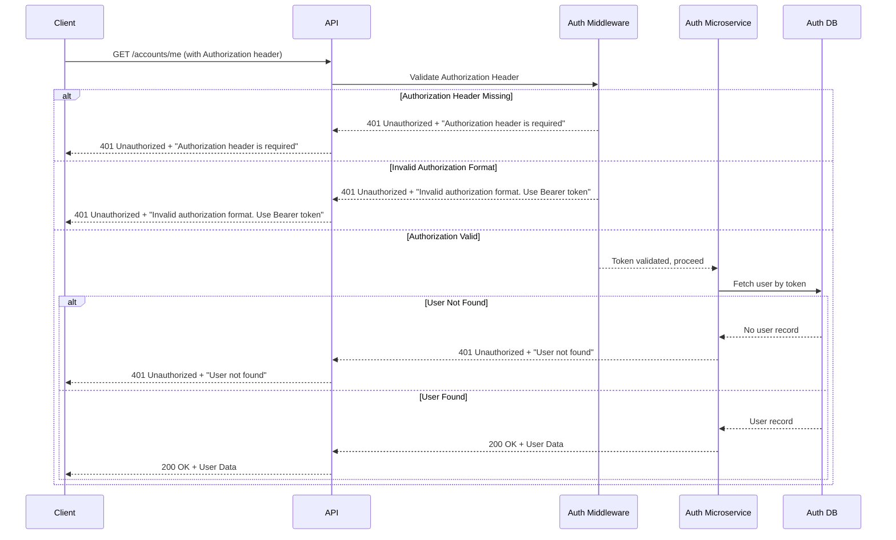

```mermaid

sequenceDiagram
    participant Client
    participant API_Gateway as API
    participant Auth_Middleware as Auth Middleware
    participant Auth_Service as Auth Microservice
    participant Auth_DB as Auth DB

    %% Fetch User Information Flow
    Client->>API_Gateway: GET /accounts/me (with Authorization header)
    API_Gateway->>Auth_Middleware: Validate Authorization Header
    
    alt Authorization Header Missing
        Auth_Middleware-->>API_Gateway: 401 Unauthorized + "Authorization header is required"
        API_Gateway-->>Client: 401 Unauthorized + "Authorization header is required"
    else Invalid Authorization Format
        Auth_Middleware-->>API_Gateway: 401 Unauthorized + "Invalid authorization format. Use Bearer token"
        API_Gateway-->>Client: 401 Unauthorized + "Invalid authorization format. Use Bearer token"
    else Authorization Valid
        Auth_Middleware-->>Auth_Service: Token validated, proceed
        Auth_Service->>Auth_DB: Fetch user by token
        alt User Not Found
            Auth_DB-->>Auth_Service: No user record
            Auth_Service-->>API_Gateway: 401 Unauthorized + "User not found"
            API_Gateway-->>Client: 401 Unauthorized + "User not found"
        else User Found
            Auth_DB-->>Auth_Service: User record
            Auth_Service-->>API_Gateway: 200 OK + User Data
            API_Gateway-->>Client: 200 OK + User Data
        end
    end

```