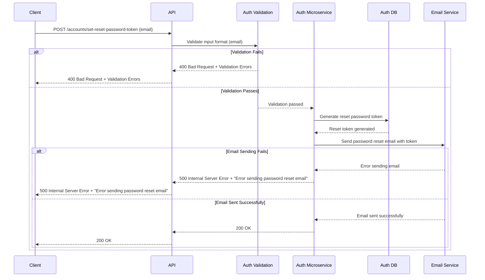

```mermaid

sequenceDiagram
    participant Client
    participant API_Gateway as API
    participant Auth_Validation as Auth Validation
    participant Auth_Service as Auth Microservice
    participant Auth_DB as Auth DB
    participant Email_Service as Email Service

    %% Set Reset Password Token Flow
    Client->>API_Gateway: POST /accounts/set-reset-password-token {email}
    API_Gateway->>Auth_Validation: Validate input format (email)
    
    alt Validation Fails
        Auth_Validation-->>API_Gateway: 400 Bad Request + Validation Errors
        API_Gateway-->>Client: 400 Bad Request + Validation Errors
    else Validation Passes
        Auth_Validation-->>Auth_Service: Validation passed
        Auth_Service->>Auth_DB: Generate reset password token
        Auth_DB-->>Auth_Service: Reset token generated
        Auth_Service->>Email_Service: Send password reset email with token
        
        alt Email Sending Fails
            Email_Service-->>Auth_Service: Error sending email
            Auth_Service-->>API_Gateway: 500 Internal Server Error + "Error sending password reset email"
            API_Gateway-->>Client: 500 Internal Server Error + "Error sending password reset email"
        else Email Sent Successfully
            Email_Service-->>Auth_Service: Email sent successfully
            Auth_Service-->>API_Gateway: 200 OK
            API_Gateway-->>Client: 200 OK
        end
    end

```