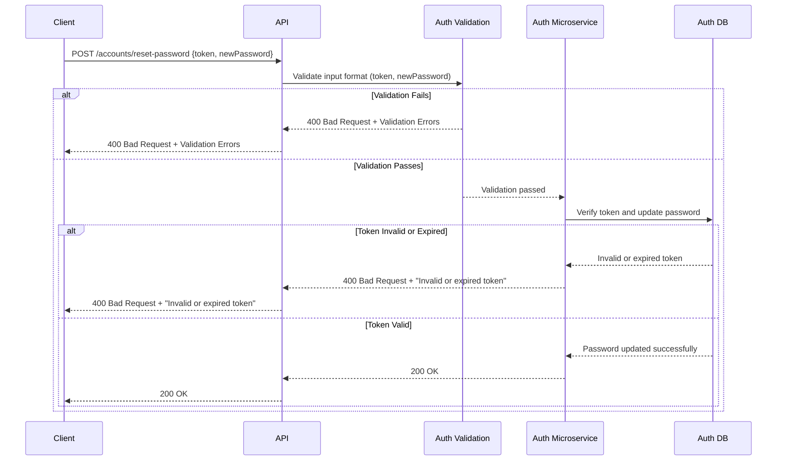

```mermaid

sequenceDiagram
    participant Client
    participant API_Gateway as API
    participant Auth_Validation as Auth Validation
    participant Auth_Service as Auth Microservice
    participant Auth_DB as Auth DB

    %% Reset Password Flow
    Client->>API_Gateway: POST /accounts/reset-password {token, newPassword}
    API_Gateway->>Auth_Validation: Validate input format (token, newPassword)
    
    alt Validation Fails
        Auth_Validation-->>API_Gateway: 400 Bad Request + Validation Errors
        API_Gateway-->>Client: 400 Bad Request + Validation Errors
    else Validation Passes
        Auth_Validation-->>Auth_Service: Validation passed
        Auth_Service->>Auth_DB: Verify token and update password
        alt Token Invalid or Expired
            Auth_DB-->>Auth_Service: Invalid or expired token
            Auth_Service-->>API_Gateway: 400 Bad Request + "Invalid or expired token"
            API_Gateway-->>Client: 400 Bad Request + "Invalid or expired token"
        else Token Valid
            Auth_DB-->>Auth_Service: Password updated successfully
            Auth_Service-->>API_Gateway: 200 OK
            API_Gateway-->>Client: 200 OK
        end
    end

```