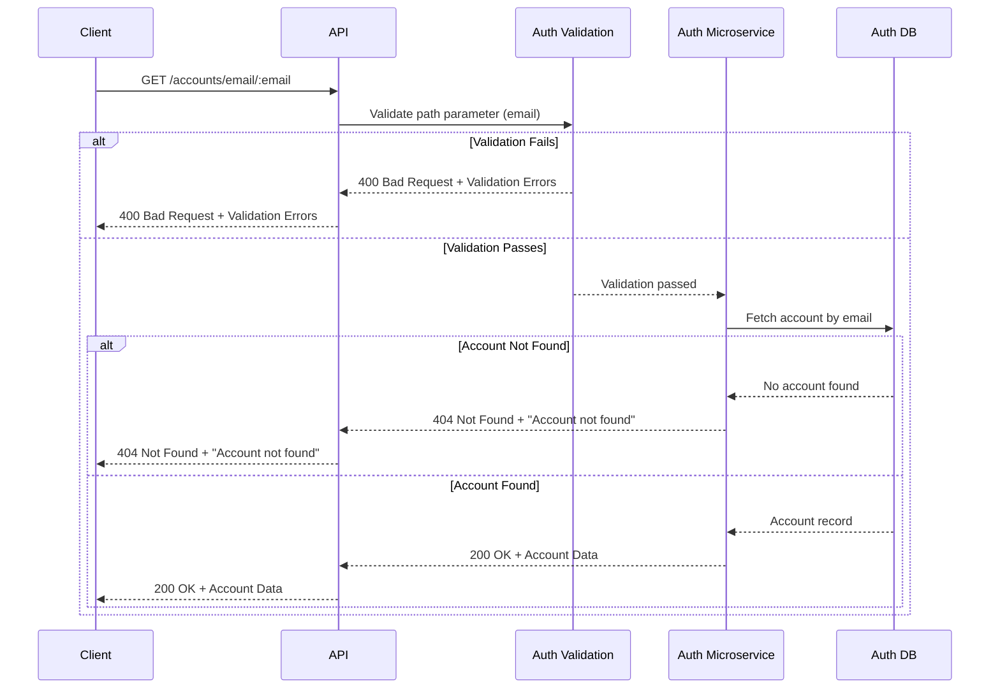

```mermaid

sequenceDiagram
    participant Client
    participant API_Gateway as API
    participant Auth_Validation as Auth Validation
    participant Auth_Service as Auth Microservice
    participant Auth_DB as Auth DB

    %% Get Account By Email Flow
    Client->>API_Gateway: GET /accounts/email/:email
    API_Gateway->>Auth_Validation: Validate path parameter (email)
    
    alt Validation Fails
        Auth_Validation-->>API_Gateway: 400 Bad Request + Validation Errors
        API_Gateway-->>Client: 400 Bad Request + Validation Errors
    else Validation Passes
        Auth_Validation-->>Auth_Service: Validation passed
        Auth_Service->>Auth_DB: Fetch account by email
        alt Account Not Found
            Auth_DB-->>Auth_Service: No account found
            Auth_Service-->>API_Gateway: 404 Not Found + "Account not found"
            API_Gateway-->>Client: 404 Not Found + "Account not found"
        else Account Found
            Auth_DB-->>Auth_Service: Account record
            Auth_Service-->>API_Gateway: 200 OK + Account Data
            API_Gateway-->>Client: 200 OK + Account Data
        end
    end

```